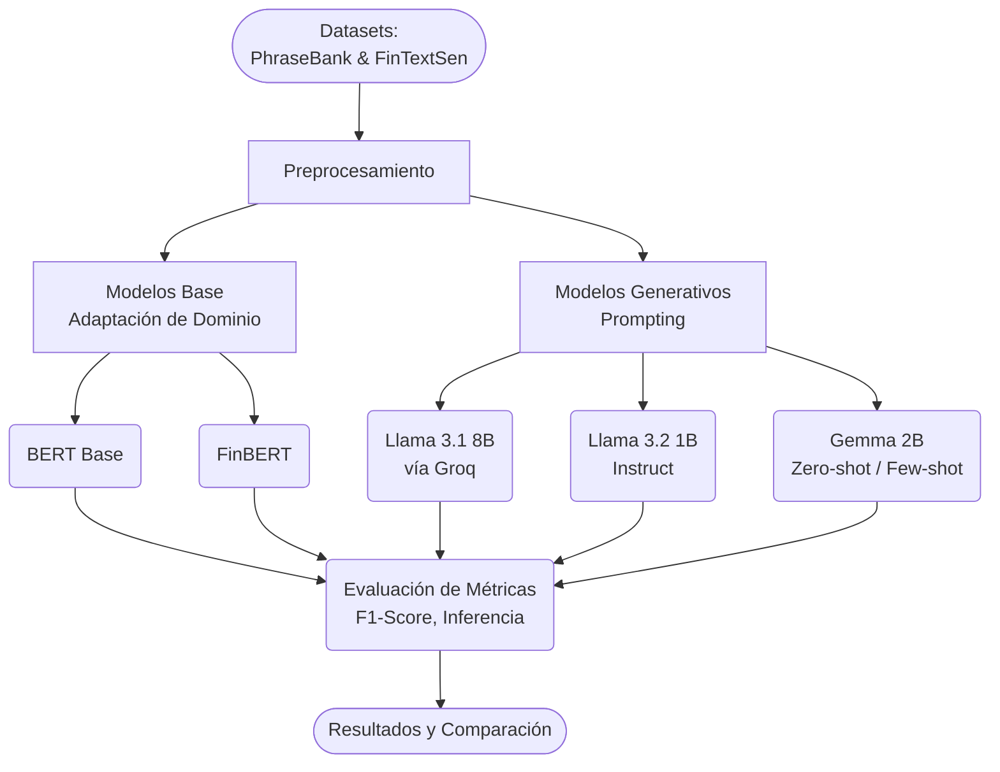

<div align="center">


[](https://git.io/typing-svg)

<br/>


</div>

---

# Análisis de sentimientos de textos financieros en la era de LLM

[Link a carpeta con presentación y reporte con documentación](https://drive.google.com/drive/folders/1dsYJDKv4PuTiTtTzTeJttwnA0eUhIUkr?usp=sharing)

## Artículo de referencia 

Peng, B., Chersoni, E., Hsu, Y.-Y., & Huang, C.-R. (2021). Is Domain Adaptation Worth Your Investment? Comparing BERT and FinBERT on Financial Tasks. Actas y repositorios de investigación en Procesamiento de Lenguaje Natural Financiero.

## Descripción del problema 

El artículo aborda el problema de determinar si realmente vale la pena la inversión de recursos y tiempo necesaria para realizar una adaptación de dominio en modelos de lenguaje avanzados. Específicamente, los autores investigan la efectividad de dos estrategias de entrenamiento para el procesamiento de textos financieros: por un lado, continuar el preentrenamiento a partir de un modelo general como BERT Base manteniendo su vocabulario general; y por el otro, entrenar un modelo completamente desde cero utilizando corpora especializados y un vocabulario adaptado al dominio. Al evaluar estas estrategias en una variedad de tareas complejas (más allá del análisis de sentimiento tradicional), el estudio busca resolver la falta de consenso sobre si un vocabulario altamente especializado es crucial en el ámbito financiero, contrastando los resultados con lo observado en otros sectores como el biomédico donde el entrenamiento desde cero sí ha demostrado ser más beneficioso.

## Resumen de Metodología 

La metodología del proyecto se estructuró en cuatro fases secuenciales diseñadas para evaluar el impacto de la adaptación de dominio en el procesamiento de lenguaje natural financiero. 
1. Recopilación de Datos, donde se reunieron diversos conjuntos de datos especializados, incluyendo Financial Phrase Bank, FinTextSen, StockSen y las subtareas de FinNum-1.
2. Preprocesamiento y Configuración de Modelos, se prepararon los textos mediante la limpieza de ruido (como etiquetas HTML, URLs y menciones de usuarios) y la tokenización adecuada para los modelos seleccionados, que incluyeron arquitecturas BERT base y variantes de FinBERT.
3. Entrenamiento y Ajuste Fino, se implementaron dos enfoques principales de manera controlada utilizando la biblioteca Hugging Face: por un lado, un preentrenamiento continuo a partir de los pesos de BERT preservando el vocabulario general, y por el otro, el entrenamiento de un modelo especializado desde cero empleando corpora financieros y un vocabulario adaptado al dominio.
4. Evaluación y Análisis, se midió el rendimiento de los modelos con las métricas **F1-micro** y la **F1-macro**.

## Objetivo de la reproducción 

El objetivo primordial de la fase de reproducción es validar la consistencia y transferibilidad de los hallazgos del artículo original ("Is Domain Adaptation Worth Your Investment? Comparing BERT and FinBERT on Financial Tasks"). Esto se realiza mediante la réplica parcial de sus experimentos bajo un entorno controlado , utilizando los modelos basados en codificadores enmascarados como BERT Base y su contraparte especializada FinBERT.  

De manera específica, esta etapa busca cumplir con los siguientes propósitos técnico-metodológicos:

* Establecer una Línea Base (Baseline): Obtener métricas de rendimiento de referencia (*Micro F1y Macro F1*) sobre los mismos conjuntos de datos (Financial PhraseBank y FinTextSen). Esto permite cuantificar con precisión el impacto real de la adaptación de dominio en tareas de análisis de sentimiento financiero bajo el paradigma tradicional de ajuste fino (fine-tuning).  

* Evaluar la Robustez ante la Variabilidad del Corpus: Analizar cómo se comportan dichos modelos preentrenados al enfrentarse a dos estructuras lingüísticas radicalmente opuestas: el lenguaje formal y estructurado de las noticias financieras, frente a la volatilidad, ruido y restricciones de longitud propios de los microblogs en redes sociales (Twitter y StockTwits).  

* Habilitar un Marco Comparativo Justo: Proveer el punto de contraste estadístico necesario para evaluar la hipótesis de nuestra propuesta de extensión. Con ello, se puede determinar si las estrategias emergentes de ingeniería de prompts (Zero-Shot y Few-Shot) en LLMs actuales logran ser competitivas, más flexibles o financieramente más rentables que el costo computacional implícito en la adaptación de dominio e infraestructura de los modelos tradicionales.

## Descripción de la propuesta de mejora

Nuestra propuesta de mejora consiste en extender la investigación original mediante la evaluación de estrategias de prompting Zero-Shot (sin ejemplos) y Few-Shot (con ejemplos de referencia) en Grandes Modelos de Lenguaje (LLMs) de última generación. Para actualizar la pregunta del artículo y determinar si en la era actual sigue siendo rentable invertir en adaptaciones de dominio costosas, implementamos este enfoque utilizando un prompt especializado que define un rol de analista financiero experto sobre arquitecturas actuales como BERT Base, FinBERT, Llama-3.2-1B-Instruct, Llama-3.1-8B-Instant y Gemma-4-12B-It. Con esto, buscamos proponer nuevas métricas en el área y analizar si el uso de instrucciones y el aprendizaje en contexto de los LLMs pueden competir de manera flexible y con un menor costo de implementación frente al paradigma tradicional de ajuste fino en modelos especializados.

## Objetivo

Responder a la pregunta: **¿Sigue siendo rentable hacer adaptación de dominio cuando existen modelos instruccionales capaces de resolver la tarea mediante prompting zero-shot o few-shot?**

Para lograrlo, se evalúa y compara el rendimiento de modelos clásicos preentrenados y adaptados al dominio financiero (como **BERT** y **FinBERT**) frente a Modelos de Lenguaje Grande (LLMs) instruccionales contemporáneos (**Llama 3.1 8B**, **Llama 3.2 1B**, y **Gemma 2B**) bajo estrategias de inferencia *zero-shot* y *few-shot* para la tarea de clasificación de sentimiento en textos e inversiones financieras.

---

## Datos

El análisis se lleva a cabo sobre dos conjuntos de datos que abarcan distintos aspectos del lenguaje financiero:

1. **Sentences_AllAgree.csv (Financial PhraseBank):**
   - Contiene **2,264** ejemplos de texto formal (noticias financieras).
   - Datos etiquetados en `0 = negative`, `1 = neutral`, `2 = positive`.
   - Orientado a probar la comprensión de descripciones empresariales y datos del mercado con alta coincidencia entre anotadores.

2. **FinTextSen.csv:**
   - Consiste en **1,680** ejemplos (después de lipieza básica).
   - Textos provenientes de microblogs (Twitter, StockTwits), lo cual significa lenguaje más breve, ruidoso e informal ("cashtags", acrónimos).
   - El conjunto representa un desafío distinto al estar fuertemente desbalanceado y repleto de jerga de inversionistas (trading).

---

## Arquitectura

El flujo experimental se ha estructurado de manera iterativa para contrastar el rendimiento relativo de distintas ramas tecnológicas.



- **Clasificadores Tradicionales:** Extracción de características y inferencia usando arquitecturas basadas en Transformers (BERT/FinBERT) configuradas para clasificación secuencial.
- **Modelos Generativos:** Inferencia usando APIs (Groq) o inferencia local en HuggingFace con prompts específicos para orientar las salidas de texto a etiquetas discretas.

---

## Estructura del proyecto

```text
final_project/
├── data/
│   ├── analisis_datasets.ipynb       # EDA de conjunto de datos
│   ├── Datos.md                      # Documentación completa de los datasets
│   ├── FinTextSen.csv                # Datos crudos de microblogs
│   └── Sentences_AllAgree.csv        # Datos formales de PhraseBank
├── src/
│   ├── experimentos_groq_llama31_8b.ipynb                # Pruebas con Llama 3.1 8B FinTextSen (usando API de Groq)
│   ├── inferencia_finbert_FinTextSen(1).ipynb            # Pruebas con FinBERT en FintextSen 
│   ├── inferencia_llama32_1b_instruc_FinTextSen(1).ipynb # Pruebas con Llama 3.2 1B en FinTextSen (usando API de Groq)
│   ├── Proyecto_FInal_bert.ipynb                         # Inferencia y evaluación tradicional con BERT FinancialPhraseBank
│   ├── ProyectoFinal_finbert.ipynb                       # Inferencia y evaluación dominial con FinBERT FinancialPhraseBank
│   ├── ProyectoFinal_llama32_1b_instruc.ipynb            # Evaluación con Llama 3.2 1B instructivo FinancialPhraseBank
│   ├── ProyectoFinalPLN_Gemma_fewshot.ipynb              # Estrategias Few-Shot mediante Gemma FinancialPhraseBank
│   └── ProyectoFinalPLN_Gemma_zeroshot.ipynb             # Inferencia Zero-Shot mediante Gemma FinancialPhraseBank
└── README.md                         # Este documento
```

--- 

## Instrucciones para ejecutar el código 

Para facilitar la reproducibilidad de los experimentos sin necesidad de configuraciones locales complejas de hardware o dependencias, todo el flujo de trabajo ha sido desarrollado e implementado mediante Jupyter Notebooks optimizados para `Google Colab`. Cada cuaderno se encuentra completamente documentado y estructurado de forma secuencial.

### Requisitos Previos y Configuración
1. Acceso a Google Colab: Asegúrese de contar con una cuenta activa de Google Drive para poder ejecutar los entornos de nube.
2. Carga de Datos: Antes de iniciar la ejecución de los cuadernos de la sección `src/`, es necesario cargar los archivos de la carpeta `data/ (FinTextSen.csv y Sentences_AllAgree.csv)` en el entorno de almacenamiento de Colab o en su defecto, configurar la ruta correspondiente si decide vincular su cuenta de Google Drive.
3. Claves de API (Si aplica): Para los cuadernos que consumen modelos externos (`experimentos_groq_llama31_8b.ipynb` y `ProyectoFinal_llama32_1b_instruc.ipynb`), asegúrese de contar con sus respectivas credenciales de Groq o acceso a Hugging Face Studio configuradas como variables de entorno (Secrets) en Colab.

### Flujo de Ejecución

La ejecución de los experimentos se realiza de forma directa siguiendo estos pasos dentro de cada archivo `.ipynb`:
1. Activación del Entorno de Hardware: Se recomienda activar un entorno de ejecución con aceleración por hardware (T4 GPU o superior) en el menú Entorno de ejecución > Cambiar tipo de entorno de ejecución, especialmente para las tareas de inferencia de los modelos base y LLMs locales.
2. Instalación de Dependencias iniciales: Ejecute la primera celda de cada cuaderno para instalar automáticamente las bibliotecas necesarias (tales como transformers, groq, scikit-learn, entre otras).
3. Ejecución Secuencial: Complete el experimento ejecutando de manera ordenada las celdas de código (Entorno de ejecución > Correr todas). Cada sección generará de forma automática las salidas correspondientes, incluyendo el cálculo de métricas (F1-Score) y la visualización de matrices de confusión.

---

## Base de datos

Las bases de datos usadas no requieren gestores de bases de datos relacionales ni bases NoSQL para su lectura de este proyecto; se distribuyen directamente en archivos CSV dentro del directorio `data/`. Estas colecciones proporcionan el ecosistema para inferencia directa.

Ambos conjuntos están codificados con etiquetas discretas (`0`, `1`, `2`) y no presentan dependencias externas para su consulta. Todo su procesamiento (limpieza de NA, balanceo, eliminación de textos extremadamente vacíos) se realiza in-memory en cada cuaderno de experimentación mediante Pandas.

---

# Comparación de métricas entre el baseline del artículo y nuestra propuesta

## Usando FinancialPhraseBank

## Tabla 1: FinBERT vs BERT 

| Métrica de Evaluación | Artículo FinBert Base | Réplica de resultados FinBert Base | Bert Artículo | Réplica de resultados BERT |
|------------------------|-----------------------|-----------------------------------|---------------|----------------------------|
| Micro F1              | 96.86                 | 97.17                             | 96.60         | 63.03                      |
| Macro F1              | 95.61                 | 96.25                             | 95.15         | 56.30                      |

---

## Tabla 2: Comparación entre Bert, Llama y Gemma

| Métrica de Evaluación | Bert Base | Llama 3.2-1B-Instruct | Gemma-4-12B-It |
|------------------------|-----------|-----------------------|----------------|
| Micro F1 - ZS         | 63.03     | 57.12                 | 93.83          |
| Macro F1 - ZS         | 56.30     | 38.78                 | 93.82          |
| Micro F1 - FS         | 53.66     | 39.91                 | 98.02          |
| Macro F1 - FS         | 44.92     | 36.27                 | 98.01          |

## Usando FinTextSen

## Métrica de Evaluación — FinBert Base

| *Métrica de Evaluación* | *Artículo FinBert Base* | *Réplica de resultados FinBert Base* |
|----------------------------|----------------------------|----------------------------------------|
| Micro F1 | 0.8308 | 0.2560 |
| Macro F1 | 0.5734 | 0.2723 |

---

## Comparativa de Modelos — FinBert vs Llama

| *Métrica de evaluación* | *FinBert* | *Llama 3.2‑1B‑Instruct* | *Llama 3.1‑8B‑Instant* |
|----------------------------|--------------|-----------------------------|---------------------------|
| Micro F1 ‑ ZS | 0.2560 | 0.3126 | 0.5844 |
| Macro F1 ‑ ZS | 0.2723 | 0.2767 | 0.4938 |
| Micro F1 ‑ FS | 0.6720 | — | 0.6816 |
| Macro F1 ‑ FS | 0.3447 | — | 0.5397 |


# Conclusiones principales 
* **Vigencia y Robustez de Modelos Especializados**: FinBERT continúa consolidándose como una referencia sumamente sólida para el análisis de sentimiento en el sector financiero. Los altos niveles de rendimiento alcanzados demuestre la enorme utilidad que poseen los modelos con adaptación de dominio cuando existe una alineación directa entre la naturaleza de los datos de entrenamiento y el entorno de evaluación. No obstante, se observa que este desempeño sobresaliente no se transfiere de manera completamente uniforme ante cualquier cambio de contexto.  

* **Pertinencia de la Ingeniería de Prompts frente a la Adaptación Tradicional**: La inclusión de estrategias Zero-Shot y Few-Shot en la metodología actualiza de forma pertinente la pregunta central planteada por el artículo original. En la era actual de los Grandes Modelos de Lenguaje (LLMs), el uso de instrucciones estratégicas demostró ser una alternativa competitiva. Especialmente en escenarios Few-Shot, el aprendizaje en contexto exhibe un gran potencial para equipararse a la adaptación de dominio tradicional sin incurrir en sus altos costos asociados, si bien todavía evidencia áreas de oportunidad al procesar clases minoritarias o subrepresentadas.  

* **Criterio de Selección según el Entorno Operativo**: Ambas aproximaciones tecnológicas poseen un valor estratégico supeditado al escenario de aplicación. Mientras que la adaptación de dominio por ajuste fino (fine-tuning) sigue siendo la opción predilecta cuando se requiere una robustez extrema ante tareas críticas y específicas, los LLMs asistidos por ingeniería de prompts representan una alternativa sumamente flexible, ágil y de rápida implementación. La decisión final entre un enfoque u otro debe fundamentarse balanceando minuciosamente el tipo de texto a procesar, la disponibilidad de infraestructura, el equilibrio en la distribución de las clases del corpus y las restricciones presupuestarias del proyecto.


## Librerías necesarias

* **[Pandas](https://pandas.pydata.org/)** — Análisis y manipulación general de datos.
* **[Scikit-learn](https://scikit-learn.org/)** — Cálculo de métricas de desempeño (F1-score, accuracy, matrices de confusión).
* **[Transformers (Hugging Face)](https://huggingface.co/docs/transformers/index)** — Carga y uso de modelos BERT, FinBERT, Llama y Gemma.
* **[PyTorch](https://pytorch.org/)** — Backend para la ejecución y ajuste de los modelos en CPU/GPU.
* **[Groq API](https://groq.com/)** — Inferencia veloz en la nube para experimentar con el modelo Llama 3.1 8B de grandes proporciones.
* **[Matplotlib](https://matplotlib.org/) / [Seaborn](https://seaborn.pydata.org/)** — Para la visualización de resultados e histogramas.

---

## Referencias

* [1] Peng, B., Chersoni, E., Hsu, Y.-Y., & Huang, C.-R. (2021). Is Domain Adaptation Worth Your Investment? Comparing BERT and FinBERT on Financial Tasks. Actas y repositorios de investigación en Procesamiento de Lenguaje Natural Financiero.
* [2] Malo, P., Sinha, A., Korhonen, P., Wallenius, J., & Takala, P. (2014). Good debt or bad debt: Detecting semantic orientations in economic texts. Journal of the Association for Information Science and Technology, 65(4), 782-796. (Fuente original del dataset Financial PhraseBank).
* [3] Cortis, K., Davis, B., McDermott, J., Handschuh, S., & Manandhar, S. (2017). SemEval-2017 Task 5: Fine-Grained Sentiment Analysis on Financial Microblogs and News. Proceedings of the 11th International Workshop on Semantic Evaluation (SemEval-2017). (Fuente base para FinTextSen).
* [4] Touvron, H., et al. (2023). Llama: Open and Efficient Foundation Language Models. Meta AI Research.
* [5] Gemma Team, Google DeepMind. (2024). Gemma: Open Models Based on Gemini Research and Technology.
* [6] Hugging Face. (2025). Transformers Documentation. Recuperado de la plataforma oficial de Hugging Face.
* [7] Documentación técnica interna del proyecto (Datos.md y README.md). Repositorio: Análisis de Sentimiento Financiero.

---

## Integrantse del Equipo

* **Fonseca González Bruno**
* **Ahuatzi Pichardo Mariano Josué**

<div align="center">


</div>
